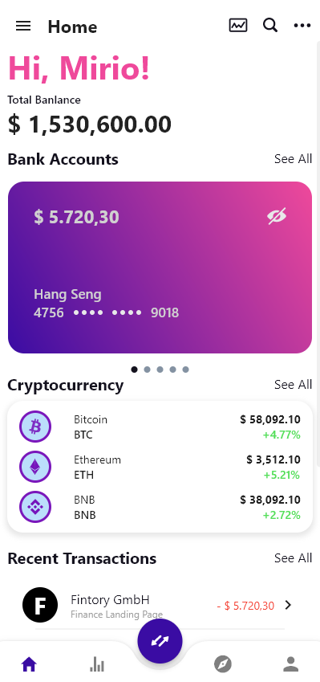
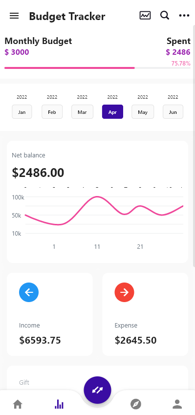
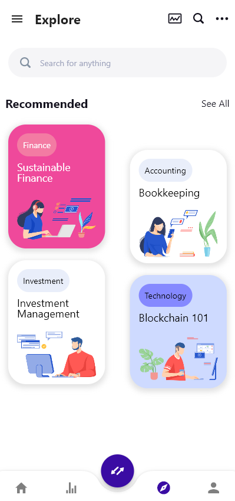
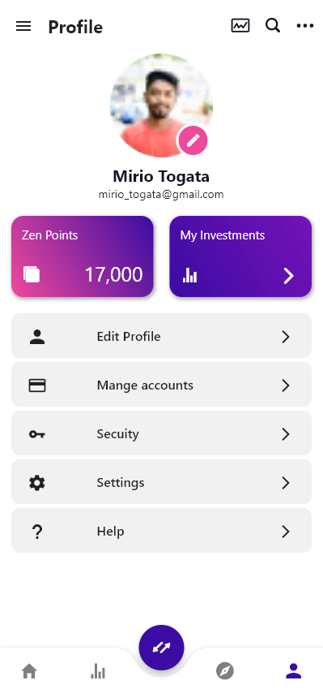
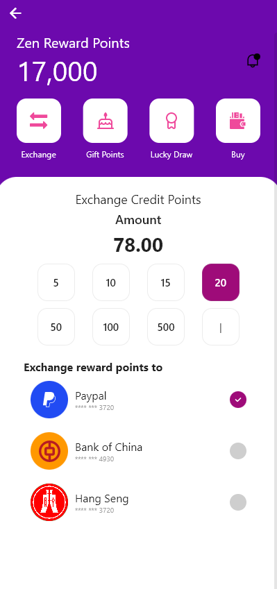
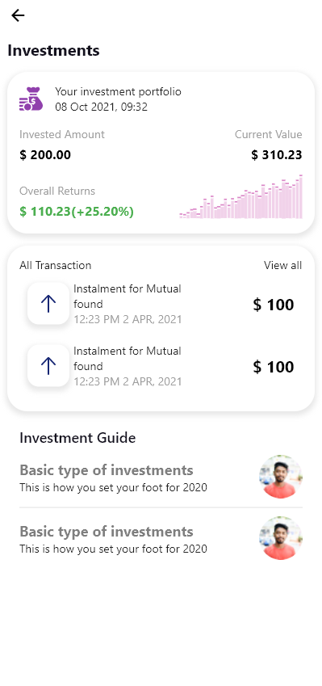

# Zenbu

A Flutter prototype built for PolyHack2022.

Team: The Goal Diggers

Developers: Holden & Jack

>Zenbu, your first open banking app. Beyond just banking.

## Installation
- Add Flutter to your machine
- Open this project folder with Terminal/CMD and run `flutter pub get`
- Run `flutter run` to build and run
```terminal
flutter pub get
flutter run
```
## Screenshots





